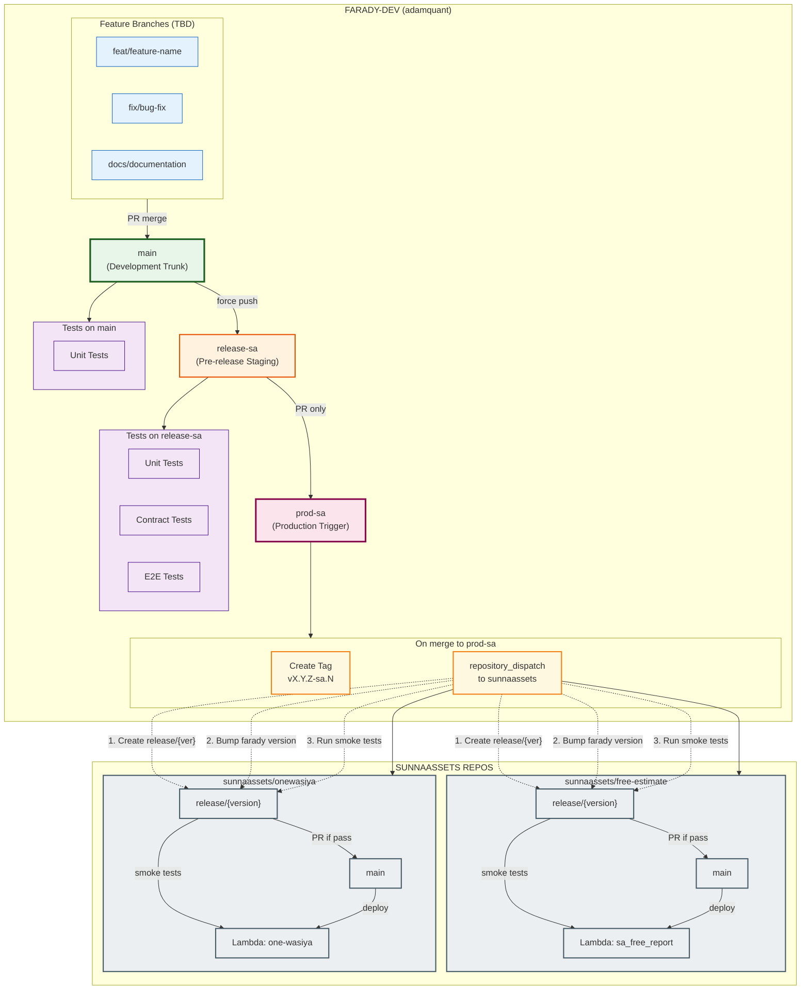

# Farady - Islamic Inheritance Distribution Calculator

[](LICENSE)
[](https://pypi.org/project/farady/)
[](https://github.com/adamquant/farady-dev/actions/workflows/ci.yml)
[](https://coveralls.io/github/adamquant/farady-dev?branch=main)

A Python library and CLI tool for calculating Islamic inheritance distribution according to Faraid (Islamic inheritance law).

## Table of Contents

- [Installation](#installation)
- [Quick Start](#quick-start)
- [API Reference](#api-reference)
  - [Core Classes](#core-classes)
  - [Convenience Functions](#convenience-functions)
  - [CSV/Batch Processing](#csvbatch-processing)
- [InheritanceResult Fields](#inheritanceresult-fields)
- [Input Parameters](#input-parameters)
- [CLI Usage](#cli-usage)
- [Examples](#examples)
- [Development](#development)

---

## Installation

```bash
pip install farady
```

Development mode:

```bash
pip install -e .
```

---

## Quick Start

```python
from farady import calculate_from_dict

# Simple case: 1 son, 1 daughter, wife
result = calculate_from_dict({"ibn": 1, "bint": 1, "zawja": True})

print(result.distribution)   # {'zawja': 0.125, 'ibn': 0.5833, 'bint': 0.2917}
print(result.ending)         # 'taseeb'
print(result.total)          # 1.0
print(result.denominator)    # 24
print(result.status)         # 'Complete'
print(result.asib)           # 'ibn-bint'
```

---

## API Reference

### Core Classes

#### `InheritanceCase`

Data class representing a family configuration for inheritance calculation.

```python
from farady import InheritanceCase

case = InheritanceCase(
    ibn=2,        # 2 sons
    bint=1,       # 1 daughter
    zawja=True,   # Wife present
    umm=1,        # Mother present
    ab=1,         # Father present
)
```

**Class Methods:**

| Method | Description |
|--------|-------------|
| `InheritanceCase(**kwargs)` | Create case with family member counts |
| `InheritanceCase.from_dict(data)` | Create from dictionary (handles string conversion) |
| `case.to_dict()` | Convert to dictionary (excludes zero/false values) |

#### `InheritanceCalculator`

Calculator class that processes inheritance cases.

```python
from farady import InheritanceCase, InheritanceCalculator

case = InheritanceCase(ibn=2, bint=1, zawja=True)
calculator = InheritanceCalculator()
result = calculator.calculate(case)
```

**Methods:**

| Method | Parameters | Returns |
|--------|------------|---------|
| `calculate(case)` | `InheritanceCase` | `InheritanceResult` |

---

### Convenience Functions

#### `calculate_inheritance(**kwargs)`

Calculate inheritance directly from keyword arguments.

```python
from farady import calculate_inheritance

result = calculate_inheritance(ibn=2, bint=1, zawja=True)
```

| Parameter | Type | Description |
|-----------|------|-------------|
| `ibn` | `int` | Number of sons |
| `bint` | `int` | Number of daughters |
| `iibn` | `int` | Number of grandsons |
| `bibn` | `int` | Number of granddaughters |
| `iiibn` | `int` | Number of great-grandsons |
| `biibn` | `int` | Number of great-granddaughters |
| `umm` | `int` | Mother (0 or 1) |
| `jadda` | `int` | Grandmother(s) (0 or 1) |
| `ab` | `int` | Father (0 or 1) |
| `jadd` | `int` | Grandfather (0 or 1) |
| `lium` | `int` | Maternal half-sibling count |
| `shaqiqa` | `int` | Full sister count |
| `shaqiq` | `int` | Full brother count |
| `uliab` | `int` | Paternal half-sister count |
| `aliab` | `int` | Paternal half-brother count |
| `ibnamm_sh` | `int` | Full nephew count |
| `ibnamm_liab` | `int` | Half nephew count |
| `amm` | `int` | Uncle count |
| `zawj` | `bool` | Husband present |
| `zawja` | `bool` | Wife present |

**Returns:** `InheritanceResult`

---

#### `calculate_from_dict(data)`

Calculate inheritance from a dictionary. Useful for loading from JSON, CSV, or form data.

```python
from farady import calculate_from_dict

# From a dictionary
data = {"ibn": "2", "bint": "1", "zawja": "True"}  # Strings are converted
result = calculate_from_dict(data)

# From form data with mixed types
data = {"ibn": 1, "bint": 2, "zawja": True, "umm": "1"}
result = calculate_from_dict(data)
```

**String Conversion Rules:**

| Field Type | String Value | Converted To |
|------------|--------------|--------------|
| Spouse (`zawj`, `zawja`) | `"True"`, `"1"`, `"yes"` | `True` |
| Spouse (`zawj`, `zawja`) | `"False"`, `"0"`, `"no"`, `""` | `False` |
| Count fields | `"1"`, `"2"`, etc. | `int` |
| Count fields | `"True"`, `"yes"` | `1` |
| Count fields | `"False"`, `"no"`, `""` | (excluded) |

**Returns:** `InheritanceResult`

---

### CSV/Batch Processing

#### `load_csv_cases(csv_path)`

Load inheritance cases from a CSV file.

```python
from farady import load_csv_cases

cases = load_csv_cases("tests/test_cases.csv")
# Returns: List[InheritanceCase]

for case in cases:
    print(case.to_dict())
```

**CSV Format:**

```csv
ibn,bint,zawja,expected_total,notes
1,1,True,1.0,Son + daughter + wife
2,0,True,1.0,Two sons + wife
0,2,True,1.125,Two daughters + wife (awl)
```

- Column headers must match valid field names (Arabic: `ibn`, `bint`, `zawja`, etc.)
- Extra columns (like `notes`, `expected_total`) are ignored
- String values are converted using same rules as `from_dict()`

**Returns:** `List[InheritanceCase]`

---

#### `process_csv_results(csv_path)`

Load CSV and calculate results for each row. Returns full context for testing/debugging.

```python
from farady import process_csv_results

results = process_csv_results("tests/test_cases.csv")

for item in results:
    row = item["row_data"]       # Original CSV row (dict)
    case = item["case"]           # InheritanceCase object
    result = item["result"]       # InheritanceResult object
    
    print(f"Case: {row.get('notes')}")
    print(f"  Distribution: {result.distribution}")
    print(f"  Ending: {result.ending}")
    print(f"  Total: {result.total}")
    print(f"  Status: {result.status}")
```

**Returns:** `List[Dict]` with keys:

| Key | Type | Description |
|-----|------|-------------|
| `row_data` | `dict` | Original CSV row data |
| `case` | `InheritanceCase` | Parsed case object |
| `result` | `InheritanceResult` | Calculation result |

---

## InheritanceResult Fields

The `InheritanceResult` dataclass is returned by all calculation functions.

```python
@dataclass
class InheritanceResult:
    distribution: dict              # Heir -> share mapping
    ending: Optional[str]           # Distribution method used
    asib: Optional[str]             # Residual heir (if any)
    total: float                    # Total of all shares
    status: str                     # Calculation status
    denominator: Optional[int]      # Total shares (raas)
    numerators: dict                # Heir -> numerator (share count)
```

### Field Details

#### `distribution: Dict[str, float]`

Dictionary mapping heir names (Arabic) to their fractional shares.

```python
result.distribution
# {'zawja': 0.125, 'ibn': 0.5833, 'bint': 0.2917}
```

#### `ending: Optional[str]`

Describes how the distribution was finalized. Useful for debugging and understanding the calculation path.

| Value | Description |
|-------|-------------|
| `"taseeb"` | Residual inheritance - remaining went to 'asib (residual heirs) |
| `"awl"` | Reduction - total exceeded 1, shares were reduced proportionally |
| `"radd"` | Return - there was leftover after fixed shares, returned to heirs |
| `"umuriya1"` | Special case: father + mother + wife |
| `"umuriya2"` | Special case: father + mother + husband |
| `"mushtaraka"` | Special case: spouse + siblings sharing |
| `"No valid heirs."` | No heirs found |
| `None` | Not determined |

```python
result.ending  # 'taseeb'
```

#### `asib: Optional[str]`

The residual heir ('aasib) who receives remaining shares after fixed portions.

```python
result.asib  # 'ibn-bint' means sons/daughters are residual heirs
```

#### `total: float`

Sum of all distributed shares. Should be 1.0 for complete cases, may differ for awl cases.

```python
result.total  # 1.0
```

#### `status: str`

| Value | Description |
|-------|-------------|
| `"Complete"` | Successfully distributed to 1.0 |
| `"Failed"` | No valid heirs found |
| `"Unknown"` | Distribution incomplete or unusual |

```python
result.status  # 'Complete'
```

#### `denominator: Optional[int]`

The total number of shares (raas) for this inheritance case. Used to express shares as "X out of N" fractions.

```python
result.denominator  # 24

# For will documents:
# "Divide estate into 24 shares: 3 to Wife, 14 to Son(s), 7 to Daughter(s)"
```

#### `numerators: Dict[str, int]`

Dictionary mapping heir names to their share count (numerator). Combined with `denominator`, gives exact fractions.

```python
result.numerators
# {'zawja': 3, 'ibn': 14, 'bint': 7}

# Combined with denominator (24):
# Wife: 3/24, Son(s): 14/24, Daughter(s): 7/24
```

### Result Methods

#### `to_pretty_dict() -> Dict[str, float]`

Convert distribution to human-readable names.

```python
result.to_pretty_dict()
# {'Wife': 0.125, 'Son(s)': 0.5833, 'Daughter(s)': 0.2917}
```

#### `get_member_fraction(member: str) -> Optional[float]`

Get share for a specific heir.

```python
result.get_member_fraction("ibn")    # 0.5833
result.get_member_fraction("zawja")  # 0.125
```

---

## Input Parameters

### Family Member Fields (Arabic Names)

| Field | Type | Description | Fixed Share |
|-------|------|-------------|-------------|
| `ibn` | `int` | Sons | Variable (asib) |
| `bint` | `int` | Daughters | 1/2 (single), 2/3 (multiple), or variable |
| `iibn` | `int` | Grandsons (son's sons) | Variable |
| `bibn` | `int` | Granddaughters (son's daughters) | Variable |
| `iiibn` | `int` | Great-grandsons | Variable |
| `biibn` | `int` | Great-granddaughters | Variable |
| `umm` | `int` | Mother | 1/6 (with children) or 1/3 |
| `jadda` | `int` | Grandmother(s) | 1/6 (if mother absent) |
| `ab` | `int` | Father | 1/6 (with children) or variable |
| `jadd` | `int` | Grandfather | Variable |
| `lium` | `int` | Maternal half-siblings | 1/3 (collectively) |
| `shaqiqa` | `int` | Full sisters | Variable |
| `shaqiq` | `int` | Full brothers | Variable (asib) |
| `uliab` | `int` | Paternal half-sisters | Variable |
| `aliab` | `int` | Paternal half-brothers | Variable |
| `ibnamm_sh` | `int` | Full nephews | Variable |
| `ibnamm_liab` | `int` | Half nephews | Variable |
| `amm` | `int` | Uncles | Variable |
| `zawj` | `bool` | Husband | 1/2 (no kids) or 1/4 |
| `zawja` | `bool` | Wife | 1/4 (no kids) or 1/8 |

### Pretty Names Reference

```python
from farady import PRETTY_NAMES

PRETTY_NAMES = {
    'ibn': 'Son(s)',
    'bint': 'Daughter(s)',
    'iibn': 'Grandson(s)',
    'bibn': 'Granddaughter(s)',
    'iiibn': 'Great-grandson(s)',
    'biibn': 'Great-granddaughter(s)',
    'umm': 'Mother',
    'jadda': 'Grandmother(s)',
    'ab': 'Father',
    'jadd': 'Grandfather (nearest in relation)',
    'lium': 'Maternal Half-sibling(s)',
    'shaqiqa': 'Full-sister(s)',
    'shaqiq': 'Full-brother(s)',
    'uliab': 'Paternal Half-sister(s)',
    'aliab': 'Paternal Half-brother(s)',
    'ibnamm_sh': 'Full-nephew(s)',
    'ibnamm_liab': 'Half-nephew(s)',
    'amm': 'Uncle(s)',
    'zawj': 'Husband',
    'zawja': 'Wife',
}
```

---

## CLI Usage

```bash
# Basic usage
farady --ibn 2 --bint 1 --zawja

# Verbose output (shows ending, asib, status)
farady --ibn 2 --bint 1 --zawja --verbose

# All flags
farady --ibn 1 --bint 2 --iibn 0 --bibn 0 --umm 1 --ab 1 --zawja
```

---

## Examples

### Example 1: Basic Case

```python
from farady import calculate_from_dict

result = calculate_from_dict({"ibn": 1, "bint": 1, "zawja": True})

print(f"Distribution: {result.distribution}")
# Distribution: {'zawja': 0.125, 'ibn': 0.5833, 'bint': 0.2917}

print(f"Ending: {result.ending}")
# Ending: taseeb

print(f"Denominator: {result.denominator}")
# Denominator: 24

# For document generation:
# "Divide into 24 shares: 3 to Wife, 14 to Son(s), 7 to Daughter(s)"
```

### Example 2: Awl Case (Shares Exceed 1)

```python
result = calculate_from_dict({"bint": 2, "zawja": True})

print(f"Total: {result.total}")       # 1.125 (exceeds 1)
print(f"Ending: {result.ending}")     # None (awl detected but not labeled)
```

### Example 3: Radd Case (Leftover After Fixed Shares)

```python
result = calculate_from_dict({"bint": 2})

print(f"Distribution: {result.distribution}")  # {'bint': 1.0}
print(f"Total: {result.total}")                # 1.0
print(f"Ending: {result.ending}")              # 'taseeb'
# Two daughters: 2/3 fixed, remaining 1/3 returned via radd
```

### Example 4: CSV Batch Processing

```python
from farady import process_csv_results

results = process_csv_results("test_cases.csv")

for item in results:
    row = item["row_data"]
    result = item["result"]
    
    # Debug output
    print(f"Case: {row.get('case_name', 'unnamed')}")
    print(f"  Ending method: {result.ending}")
    print(f"  Total: {result.total}")
    print(f"  Status: {result.status}")
    if result.asib:
        print(f"  Residual heir: {result.asib}")
    print()
```

### Example 5: Form Data Integration

```python
from farady import calculate_from_dict

# From web form (strings)
form_data = {
    "ibn": "2",
    "bint": "1",
    "zawja": "yes",  # Will be converted to True
    "umm": "1",
}

result = calculate_from_dict(form_data)

# Use denominator for will document
if result.denominator:
    shares_text = []
    for heir, share in result.distribution.items():
        num_shares = round(share * result.denominator)
        shares_text.append(f"{num_shares} shares to {heir}")
    
    print(f"Divide into {result.denominator} shares:")
    print("\n".join(shares_text))
```

---

## Development

Run tests:

```bash
pytest tests/ -v
```

Run specific test:

```bash
pytest tests/test_farady.py::TestCalculateFromDict::test_son_daughter_wife -v
```

### Monte Carlo Testing

Monte Carlo tests verify inheritance calculations across thousands of randomly generated cases. The improved testing infrastructure includes:

#### Quick Start

1. Run the Monte Carlo tests:
   ```bash
   poetry run python scripts/generate_monte_results.py
   ```

2. Customize the number of test cases (default is 1000 for faster iteration):
   ```bash
   FARADY_MONTE_LIMIT=5000 poetry run python scripts/generate_monte_results.py
   ```

3. Analyze failures in Jupyter:
   ```bash
   jupyter notebook tests/review.ipynb
   ```

#### Configuration

The number of test cases can be configured using the `FARADY_MONTE_LIMIT` environment variable:
- Default: 1000 cases (faster iteration during development)
- To run more comprehensive tests: `FARADY_MONTE_LIMIT=10000`
- To run fewer cases for quick testing: `FARADY_MONTE_LIMIT=100`

For debugging specific issues, you might want to run with a smaller limit to get faster feedback:
```bash
FARADY_MONTE_LIMIT=100 poetry run python scripts/generate_monte_results.py
```

For production validation, you might want to run with a larger limit:
```bash
FARADY_MONTE_LIMIT=50000 poetry run python scripts/generate_monte_results.py
```

#### Analysis Tools

The `tests/review.ipynb` notebook provides powerful querying and debugging capabilities:

##### Loading and Setup
When you open the notebook, the first cell automatically loads all failure reports and creates DataFrames for analysis. It will show you:
- Which failure reports were loaded
- How many failures exist for each test
- Available DataFrames for querying (`master_df` for all tests, plus individual test DataFrames)

##### Querying Failures
The notebook provides several helper functions for filtering and analyzing failures:

- `get_failure_summary(df)`: Get a summary of failures by test and category
- `filter_by_heir(df, heir_name)`: Filter failures that involve a specific heir
- `filter_by_status(df, status)`: Filter failures by calculation status
- `filter_by_ending(df, ending)`: Filter failures by calculation ending
- `filter_by_total_range(df, min_total, max_total)`: Filter by total distribution range
- `find_similar_cases(df, case_pattern)`: Find cases matching a pattern dictionary
- `sample_failures(df, n)`: Get a random sample of failures for quick inspection

##### Detailed Inspection
Use `inspect_case(df, index)` to examine a specific failure case in detail:
- View the complete input case parameters
- See the calculation result including distribution, total, status, and denominators
- Examine individual heir shares and numerators

##### Debugging Workflow
1. Run the Monte Carlo tests with an appropriate limit:
   ```bash
   FARADY_MONTE_LIMIT=1000 poetry run python scripts/generate_monte_results.py
   ```

2. Open the analysis notebook:
   ```bash
   jupyter notebook tests/review.ipynb
   ```

3. Run the first cell to load all failure data

4. Use the helper functions to narrow down to specific types of failures:
   ```python
   # Find all failures involving spouses
   spouse_failures = filter_by_heir(master_df, 'zawj')
   get_failure_summary(spouse_failures)
   
   # Look at incomplete calculations
   incomplete = filter_by_status(master_df, 'Incomplete')
   sample_incomplete = sample_failures(incomplete, 3)
   for i in range(len(sample_incomplete)):
       inspect_case(sample_incomplete, i)
       print("-" * 50)
   ```

5. For detailed analysis of a specific case, use `inspect_case()` with the index of interest

#### Manual Inspection and Pattern Recognition

The notebook makes it easy to identify patterns in failures:
- Use `find_similar_cases()` to locate cases with similar input parameters
- Filter by specific heirs, statuses, or calculation endings
- Sample random failures to get a broad view of issues
- Compare distributions and totals to identify calculation anomalies

This makes it much easier to debug edge cases and improve the calculation engine.

---

## Branching Model

This project uses a **hybrid branching model** combining:

1. **Trunk-Based Development (TBD)** for core module development
2. **Gitflow** for production releases to SunnaAssets

### Branch Architecture Diagram



### Branch Roles

| Repo | Branch | Role |
|------|--------|------|
| farady-dev | `main` | Development trunk (TBD) |
| farady-dev | `release-sa` | Pre-release staging (no infra tests) |
| farady-dev | `prod-sa` | Production trigger, dispatches to SA |
| sunnaassets/* | `main` | Production, deploys Lambda |
| sunnaassets/* | `release/{version}` | Auto-created per release, smoke tests run here |

### Release Workflow

1. **Develop on `main`** using TBD (feature branches → PR → merge)
2. **Stage release** by force pushing to `release-sa`:
   ```bash
   git push origin main:release-sa --force
   ```
3. **Tests run on farady-dev** - Unit, contract, and E2E tests (no AWS access needed)
4. **Create PR** from `release-sa` to `prod-sa`
5. **Merge triggers**:
   - Version tag created automatically in farady-dev
   - `repository_dispatch` sent to sunnaassets repos
   - Each sunnaassets repo:
     - Creates `release/{version}` branch
     - Updates requirements.txt with new farady version
     - Runs smoke tests against deployed Lambda
     - If pass: creates PR to main (manual merge required)
     - If fail: creates issue with `release-failed` label

### Versioning

Releases to SunnaAssets use the format `vX.Y.Z-sa.N`:

- `X.Y.Z` = Semantic version (major.minor.patch)
- `sa` = SunnaAssets release identifier
- `N` = Release number for that version

Examples: `v0.1.0-sa.1`, `v0.1.0-sa.2`, `v0.2.0-sa.1`

### Version Management

Use the version script for bumping:

```bash
python scripts/version.py current           # Show current version
python scripts/version.py bump minor        # Bump minor version
python scripts/version.py bump major        # Bump major version
python scripts/version.py tag               # Create SA release tag
```

---

## Schools of Thought (Madhahib)

### Current Implementation (v0.1.0)

This version implements a simplified approach to Islamic inheritance that does not yet support toggling between the four madhahib (schools of thought). The following rules are currently hardcoded:

1. **Siblings blocked by father/grandfather**: All siblings (full, paternal half, and maternal half) are completely blocked from inheritance when a father or grandfather is present. This follows the majority opinion.

2. **Radd to spouse when alone**: If no blood relatives are present to receive the excess (radd), the remainder is allocated to the surviving spouse. This is a contemporary practice adopted by some scholars and is not universally accepted across all madhahib.

### Planned: Madhahib Toggle (v0.2.0)

A future release will introduce configuration options to toggle between different schools of thought, including:

- Hanafi
- Maliki  
- Shafi'i
- Hanbali

This will affect rulings on:
- Grandfather vs siblings competition
- Radd distribution rules
- Special cases (mushtaraka, umuriya)

See issue [#20](https://github.com/adamquant/farady-dev/issues/20) for progress on this feature.

---

## License

**GNU Affero General Public License v3.0 (AGPLv3)**

This software is licensed under AGPLv3. See the [LICENSE](LICENSE) file for the full text.

### Key Points of AGPLv3

- **Commercial Use Allowed**: You may use this software for commercial purposes
- **Source Required**: If you modify this software and run it as a network service, you must make your modifications available to users
- **Share Alike**: If you distribute modified versions, they must be licensed under AGPLv3
- **Attribution**: You must give appropriate credit to Adam Ahmed

### Enterprise & Commercial Use

AGPLv3 is a strong copyleft license. If you:
- Use it as-is: No restrictions
- Host it as a service: You must provide source code to users
- Modify it: Must distribute your modifications under AGPLv3

For traditional commercial licensing (to avoid copyleft obligations), please contact the author.
