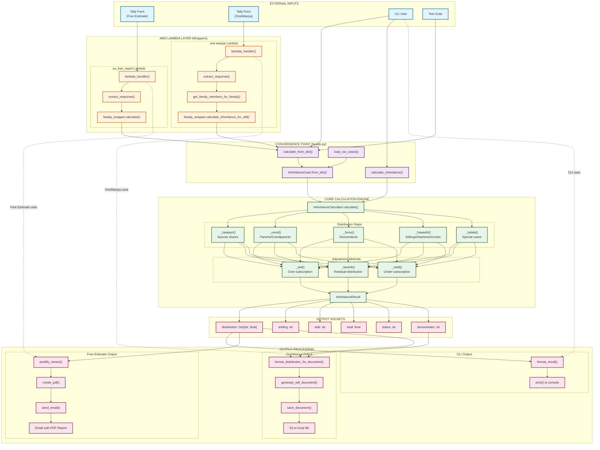

# Farady-py Architecture Diagram

> Generated: 2026-02-22 20:20:41

## Overview

This diagram shows the complete data flow through the farady-py library, from external inputs through the core calculation engine to output processing.

## Architecture Diagram

## Component Descriptions

### External Inputs

| Component | Description |
|-----------|-------------|
| Tally Form (Free Estimate) | Webhook from Tally form for free inheritance estimates |
| Tally Form (OneWasiya) | Webhook from Tally form for will generation service |
| CLI User | Command-line user running `farady --ibn 2 --bint 1 --zawja` |
| Test Suite | Pytest tests calling the library directly |

### Lambda Layer (Wrappers)

| Component | Description |
|-----------|-------------|
| sa_free_report Lambda | AWS Lambda for free estimate service |
| one-wasiya Lambda | AWS Lambda for will generation service |
| extract_response() | Parses Tally webhook JSON into family data dict |
| farady_wrapper.calculate() | Wraps farady for Free Estimate service |
| farady_wrapper.calculate_inheritance_for_will() | Wraps farady for OneWasiya service |

### Convergence Point

| Function | Description |
|----------|-------------|
| `calculate_from_dict()` | Main entry point for dict input |
| `calculate_inheritance()` | Entry point for kwargs input |
| `InheritanceCase.from_dict()` | Converts dict to InheritanceCase |
| `load_csv_cases()` | Loads cases from CSV file |

### Core Calculation Engine

| Component | Description |
|-----------|-------------|
| `InheritanceCalculator.calculate()` | Main calculation orchestrator |
| `_zawjayn()` | Calculates spouse shares |
| `_usool()` | Calculates parents/grandparents shares |
| `_furoo()` | Calculates descendants shares |
| `_hawashi()` | Calculates siblings/nephews/uncles shares |
| `_kalala()` | Handles special kalala cases |
| `_awl()` | Handles over-subscription (awl) |
| `_taseeb()` | Handles residual distribution |
| `_radd()` | Handles under-subscription (radd) |

### Output Sockets

| Field | Type | Description |
|-------|------|-------------|
| `distribution` | `Dict[str, float]` | Heir name → share (decimal) |
| `ending` | `str` | How distribution ended (awl/radd/taseeb/etc.) |
| `asib` | `str` | The residual heir if present |
| `total` | `float` | Total shares accounted for (should be 1.0) |
| `status` | `str` | Complete/Failed/Unknown |
| `denominator` | `int` | Total number of shares (raas) |

### Output Processing

| Service | Processing Flow |
|---------|-----------------|
| CLI | `format_result()` → `print()` to console |
| Free Estimate | `prettify_names()` → `create_pdf()` → `send_email()` |
| OneWasiya | `format_distribution_for_document()` → `generate_will_document()` → `save_document()` |

## Key Insights

1. **Single Convergence Point**: All inputs eventually call `InheritanceCalculator.calculate()` through `calculate_from_dict()` or `calculate_inheritance()`

2. **Lambda Independence**: Lambda functions are pure wrappers - they don't interact with CLI at all

3. **Output Socket Matching**: Each input source has corresponding output processing:
   - CLI → console print
   - Free Estimate → PDF + email
   - OneWasiya → will document + S3/local storage

4. **No Public API Yet**: The library is consumed internally by SA services, not exposed as a public API
