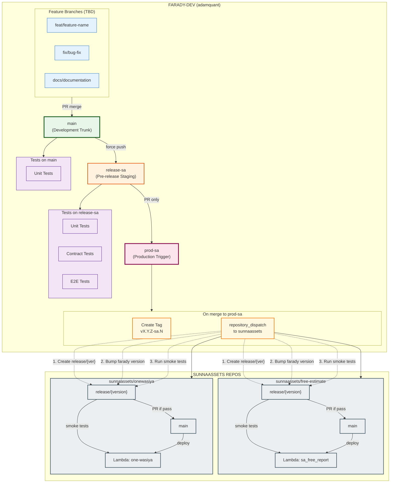

# Farady-dev Branching Strategy

> Generated: 2026-02-22 22:35:16

## Overview

This project uses a **hybrid branching model** combining:

1. **Trunk-Based Development (TBD)** for core module development
2. **Gitflow** for production releases to SunnaAssets

## Branch Architecture Diagram




## Branch Roles

| Repo | Branch | Role |
|------|--------|------|
| farady-dev | `main` | Development trunk (TBD) |
| farady-dev | `release-sa` | Pre-release staging (no infra tests) |
| farady-dev | `prod-sa` | Production trigger, dispatches to SA |
| sunnaassets/* | `main` | Production, deploys Lambda |
| sunnaassets/* | `release/{version}` | Auto-created per release, smoke tests run here |

## Workflow

### Feature Development (TBD on `main`)

1. **Create Issue** - Use gh cli
2. **Create Branch** - From `main`, naming: `feat/`, `fix/`, `docs/`
3. **Do Work** - Implement the feature/fix
4. **Commit & Push** - Commit changes and push to remote
5. **Create PR** - Raise pull request to `main`
6. **Merge** - After review, merge to `main`

### SunnaAssets Release (Gitflow)

1. **Stage Release** - Force push `main` to `release-sa`:
   ```bash
   git push origin main:release-sa --force
   ```

2. **Tests Run on farady-dev** - Unit, contract, and E2E tests (no AWS access needed)

3. **Create PR** - From `release-sa` to `prod-sa`

4. **Merge Triggers**:
   - Version tag created automatically in farady-dev
   - `repository_dispatch` sent to sunnaassets repos
   - Each sunnaassets repo:
     - Creates `release/{version}` branch
     - Updates requirements.txt with new farady version
     - Runs smoke tests against deployed Lambda
     - If pass: creates PR to main (manual merge required)
     - If fail: creates issue with `release-failed` label

## Version Format

```
vX.Y.Z-sa.N

X.Y.Z = Semantic version (major.minor.patch)
sa     = SunnaAssets release identifier
N      = Release number for that version

Examples:
  v0.1.0-sa.1  (first SA release)
  v0.1.0-sa.2  (second release, same version)
  v0.2.0-sa.1  (new minor version)
```

## Key Rules

### For Feature Development
- **NEVER** work directly on `main` branch
- **ALWAYS** use a feature branch for ANY change
- **ALWAYS** follow: issue → branch → work → commit → PR → merge

### For Releases
- **NEVER** push directly to `prod-sa`
- **ALWAYS** go through: main → release-sa → PR → prod-sa
- **ONLY** PRs from `release-sa` are valid for `prod-sa`

## Test Isolation

### farady-dev
- **Unit tests** (`tests/`) - Run on `main` branch via CI
- **Contract tests** (`tests/integration/test_api_contract.py`) - Schema validation
- **E2E tests** (`tests/integration/test_e2e.py`) - Calculation logic

All tests in farady-dev run **without AWS access**.

### sunnaassets repos
- **Smoke tests** (`tests/smoke/test_lambda_smoke.py`) - Invoke actual Lambda functions
- Run on `release/{version}` branch before PR to main
- Use sunnaassets' own AWS credentials
